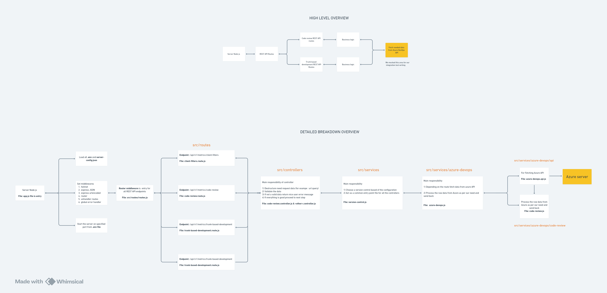

# Software Practices Metrics Tool

This repository contains the backend code for API's related to Software
 Practices Metrics tool.

## Getting Started

Follow the installation instructions below to set up the project.

## Installation

### 1. Set Up Your Environment

Refer [Get Started](../README.md#getting-started) for setting up repository and
 install dependencies.

### 4. Start the application

1. Once the dependencies are installed, you can start the application by
 running the following command in terminal:

   ```bash
   npm run start:dev
   ```

2. The above command will execute the specified script in the `scripts`
section of the `package.json` file, typically
   used for starting the development server.

### 5. Access the Application

1. Once the development server is running, open your web browser and go to the address
   [http://localhost:3000](http://localhost:3000) and access the application.

## Run application in production

## Test the Application

1. This repository consists of unit, integration tests for server.
2. You can generate test coverage by executing the following command

```bash
# command to run unit & integration tests
$ npm run test
```

## Linting & formatting

Linting and formatting are essential for maintaining code quality and consistency
 throughout a project.

**1. Check for Linting Issues:**

   ```bash
   npm run lint
   ```

   This command runs the linter to check for any syntax errors, code style
    violations, or potential bugs in your codebase. It provides a report of
     any issues found, helping you identify areas for improvement.

**2. Format Codebase:**

   ```bash
   npm run format
   ```

   This command formats your codebase according to the configured code style
    rules. It helps maintain consistency in code formatting across different
     files and modules, making the codebase easier to read and understand.

## Release to production

1. TODO: After Integrating with CI/CD update the steps here

## API End Points

1. Swagger Open API specification document can be accessed at the following URL:

   1. <http://localhost:3000/open-api-spec-doc/>

## Server Architecture



The following image provides an overview of the server architecture employed in
this project. It illustrates the various services and their interactions,
offering insight into the underlying infrastructure and technology stack used
to power the backend of the application. Understanding the server architecture
is crucial for developers and stakeholders alike to comprehend how data flows
and services are orchestrated within the system.
