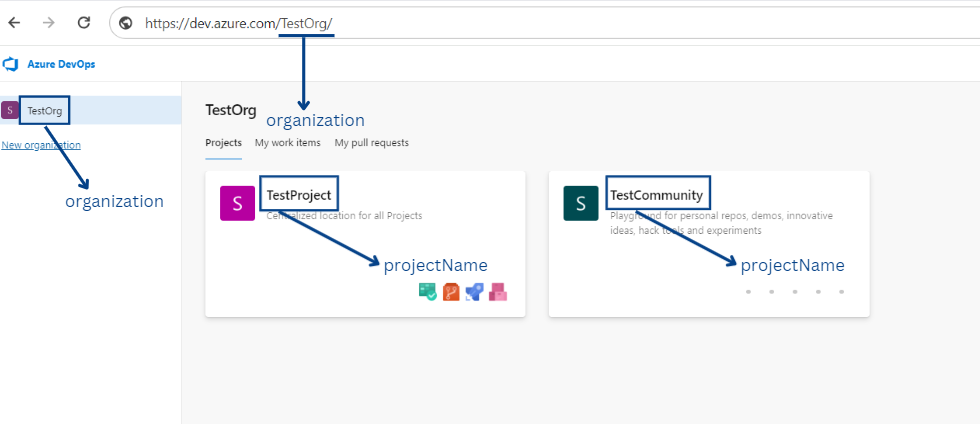
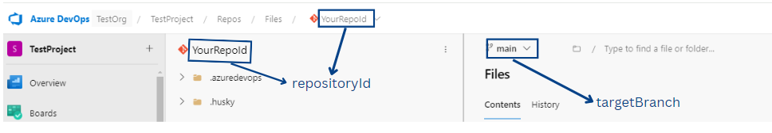

# Software Practices Metrics Tool

This repository contains the backend code for API's related to Software
Practices Metrics tool.

## Getting Started

Follow the installation instructions below to set up the project.

## Installation

### 1. Set Up Your Environment

Refer [Get Started](../README.md#getting-started) for setting up repository and
install dependencies.

### 2. Start the Application

1. Once the dependencies are installed, make sure you have configured
server-config.json in configs directory follow the steps
[Configure Server Configuration File](#configure-server-configuration-file).

2. After configuring you can start the application by
running the following command in terminal:

   ```bash
   npm run start:dev
   ```

3. The above command will execute the specified script in the `scripts`
section of the `package.json` file, typically
used for starting the development server.

### 3. Access the Application

Once the development server is running, open your web browser and go to the address
[http://localhost:3498](http://localhost:3498) and access the application.

## Test the Application

1. This repository consists of unit, integration tests for server.
2. You can generate test coverage by executing the following command

```bash
# command to run unit & integration tests
$ npm run test
```

## Linting & Formatting

Linting and formatting are essential for maintaining code quality and consistency
throughout a project.

**1. Check for Linting Issues:**

   ```bash
   npm run lint
   ```

   This command runs the linter to check for any syntax errors, code style
   violations, or potential bugs in your codebase. It provides a report of
   any issues found, helping you identify areas for improvement.

**2. Fix Linting Issues Automatically:**

   ```bash
   npm run lint-fix
   ```

   This command not only checks for linting issues but also attempts to
   automatically fix them where possible. It's useful for quickly addressing
   common issues and ensuring that your code follows the defined coding standards.

**3. Format Check:**

   ```bash
   npm run format-check
   ```

   This command runs the formatter to check for any css formatting violations in
   your codebase. It provides a report of any issues found, helping you identify
   areas for improvement.

**4. Format Codebase:**

   ```bash
   npm run format
   ```

   This command formats your codebase according to the configured code style
   rules. It helps maintain consistency in code formatting across different
   files and modules, making the codebase easier to read and understand.

## Configure Server Configuration File

To connect the Software Practices Metrics Tool to your Azure DevOps repositories,
you need to configure the server configuration file named `server-config.json`.
This file contains the necessary settings for authentication and repository connection.

Below is an example of the `server-config.json` file:

```json
{
   "targetBranch": "main",
   "organization": "Soliton",
   "projectName": "my_project",
   "repositoryId": "my_repository",
   "authToken": "my_auth_token",
   "squads": []
}
```

In `server-config.json` file `targetBranch`, `organization`, `projectName`, `repositoryId`,
`authToken` are **mandatory** fields and `squads` is optional field. If you are
not configuring squads leave it as empty (`"squads": []`),
to configure squads refer [here](#optional-configurations-in-server-config-json-file).

## Steps to Find Out Azure Repo Details

Go to your [Azure DevOps](https://dev.azure.com/) and get the details for
`server-config.json` fields as shown below.





## Steps to Create Azure Devops Auth Token

1. Sign up to [Azure Devops](https://dev.azure.com/).

2. Find Personal access tokens in user settings (beside profile picture).

3. Click on Personal access tokens.

4. Create new Token by clicking on `New Token`.

5. Enter a name for your token.

6. Choose the organization where you want to use the token.

7. Set the expiration, scopes as `Custom defined` and tick `Read` for Code.

8. Click on `Create`.

9. Ensure to copy and save the token value as **it won't be recoverable if lost.**

## Optional Configurations in server-config json File

### Advantage of using squads optional field

1. Squads are useful when you are working
on large repository with a high volume of pull requests or you are
finding it difficult to search your team pull requests.

2. Squads are optional configuration. Configuring `squads` will be active the
   filter in code review metrics page(near to top search bar) which can be used
   to filter only the needed data based on `authors` and `reviewers`.

3. In a squad, reviewers are not required fields, while at least one developer
is mandatory. Refer below format.

   ```json
   {
      "squads":[
         {
            "squadName": "Squad_name",
            "developers": {
               "9e1413a9-2b7c-6556-b441-e1eabfed5d43": "Developer_name"
            }
         }
      ] 
   }
   ```

4. If you set reviewers for squads and select them in the application,
only pull requests containing those reviewers will be filtered.

5. A reviewer is recognized as such for a pull request only if they've given
any vote on it.

6. Ensure you enter same name for developers & reviewers section in the
`server-config.json` which will be displayed in the dashboard to avoid confusion.

### How to configure squads

1. Please refer [Steps to get developer uuid](#steps-to-get-developer-uuid) &
[Steps to get reviewer uuid](#steps-to-get-reviewer-uuid) to know how to get
the uuids using our tool before starting with below steps.

2. Update squads in `server-config.json` with relevant details
for filtering in the application. Refer below format.

    ```json
    {
      "squads":[
         {
            "squadName": "Squad_name",
            "developers": {
               "9e1413a9-2b7c-6556-b441-e1eabfed5d43": "Developer_name"
            },
            "reviewers": {
               "4c56f2d9-f179-65fd-af3d-0650c183e580": "Reviewer_name"
            }
         }
      ]
    }
    ```

3. Ensure entering unique squad name to avoid confusion. And enter the details
of developers and reviewers as array of key value pairs specified in the below
format.
   - `developer_uuid (or) reviewer_uuid : developer_name (or) reviewer_name`

### Steps to get developer uuid

1. Open the application & got to code review page.

2. Go to the `Author` column of the code review metrics table.

3. Hover over the any one of the author name to see the author name and their uuid

4. Click on the author name to copy the author name and uuid to the clipboard.

5. Copy and paste the name & uuid in `server-config.json` in specified format.

### Steps to get reviewer uuid

1. Open the application & got to code review page.

2. Click on the votes history timeline or current votes timeline in code review table
   to open the dialog modal for reviewers.

3. Go to the `Reviewed By` column of the votes timeline table.

4. Hover over the any one of the reviewer name to see the name and their uuid.

5. Click on the reviewer name to copy the reviewer name and uuid to the clipboard.

6. Copy and paste the name & uuid in `server-config.json` in specified format.

## Technologies Used

1. The server side of the application is powered by [ExpressJS](https://expressjs.com/),
a fast, and minimalist web framework for Node.js, providing robust and flexible
routing and middleware capabilities.

2. For testing the server, we used [Jest](https://jestjs.io/), a popular
JavaScript testing framework known for its simplicity and versatility, allowing
us to write and execute tests with ease.

3. [Supertest](https://www.npmjs.com/package/supertest) was utilized alongside
Jest for HTTP assertions and testing, enabling us to make HTTP requests to our
Express application and assert the responses, ensuring reliable and
comprehensive server-side testing coverage.

## API End Point

Swagger Open API specification document can be accessed at the following URL:

<http://localhost:3498/open-api-spec-doc/>
